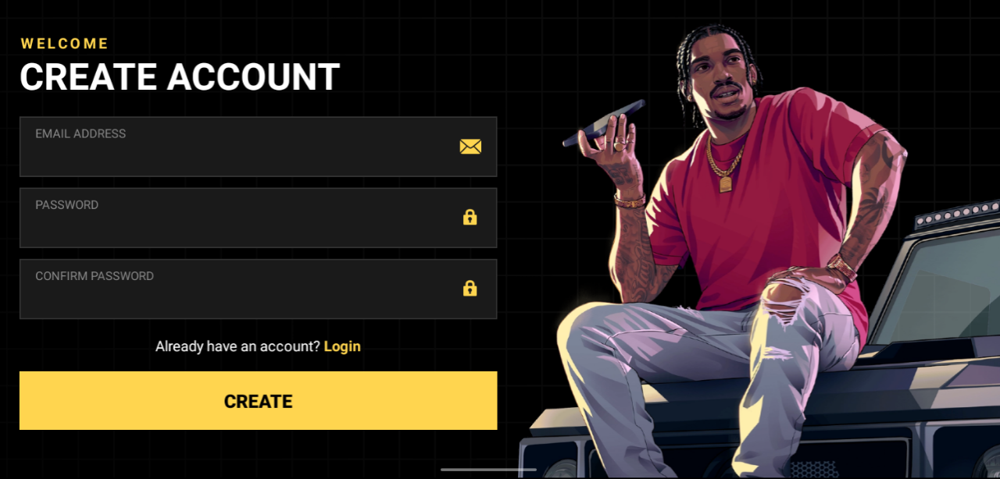
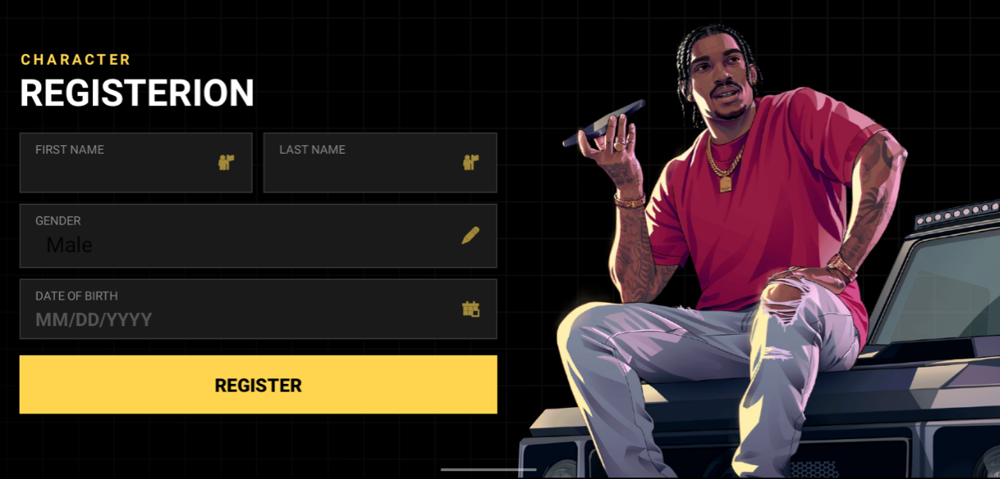
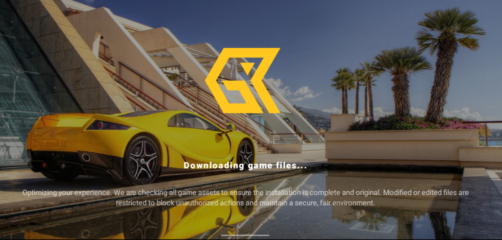
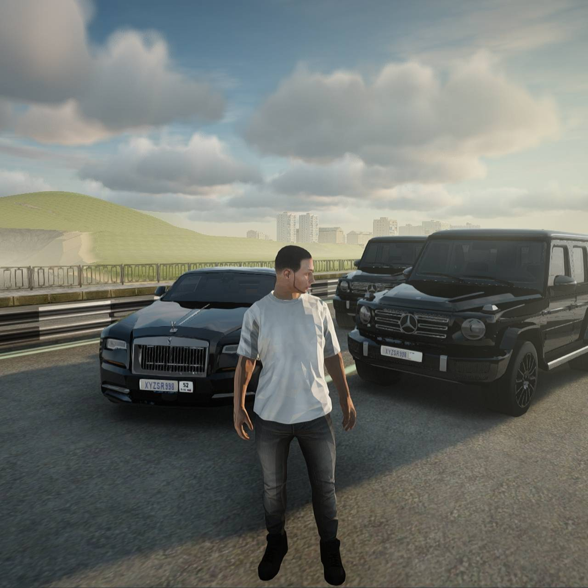
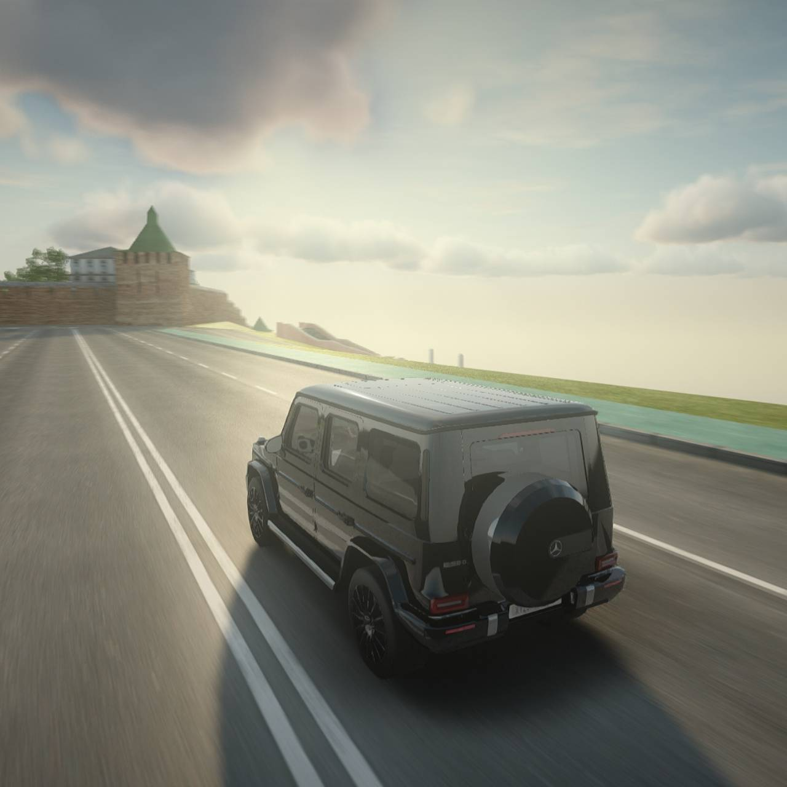
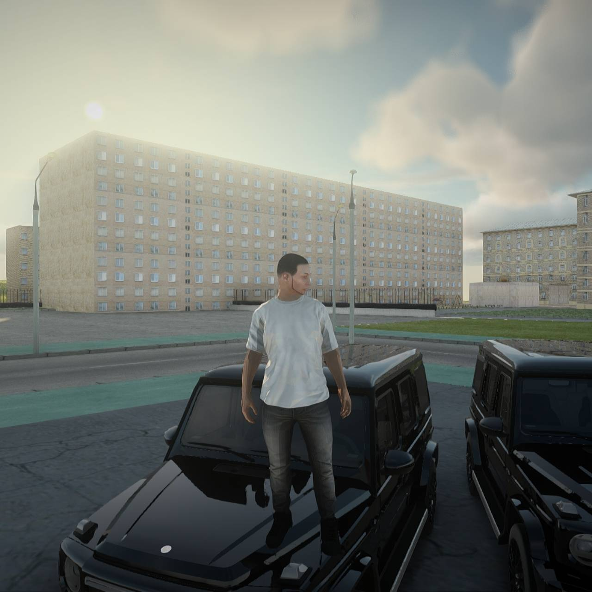
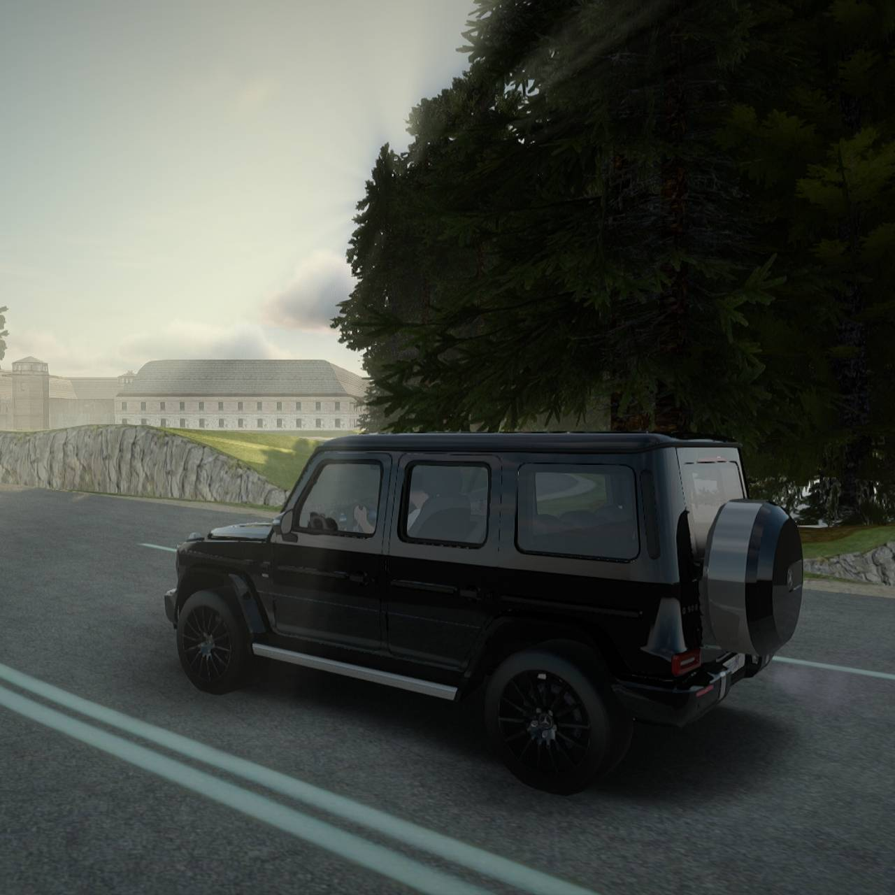

  

<h1 align="center">Grand RazX RP Online</h1>

  <b>A cross-platform multiplayer ecosystem seamlessly bridging Android and PC players.</b>

Grand RazX RP Online is a custom-built CRMP (Multiplayer) ecosystem based on the Grand Theft Auto: San Andreas engine. Developed independently over the course of a year, this project encompasses a custom Android launcher, native C++ system integrations, robust backend authentication, and a synchronized multiplayer infrastructure.

## 🛠️ Technology Stack

### Client & Native Integration

### Backend & Infrastructure

### Multiplayer Core

---

## 🏗️ Core Engineering Infrastructure

The platform is driven by a custom Android Launcher that serves as the central hub for authentication, secure asset delivery, and game execution. 

  

### 1. Advanced Asset Pipeline & Delivery
Engineered a comprehensive asset management system to handle game files across diverse hardware profiles.
* **Delta Patching System:** Downloads only modified bytes rather than entire archives, drastically reducing bandwidth overhead.
* **Anti-Tamper Verification:** Implements strict cryptographic hashing to verify file integrity and prevent client-side cheating before execution.
* **JNI Execution Bridge:** Utilizes the Java Native Interface (JNI) to securely pass launch parameters and execute the underlying C++ game engine directly from the Android environment.

### 2. Identity & Security Layer
Built a frictionless but highly secure authentication flow.
* **Multi-Provider OAuth:** Supports standard Email/Password alongside Google Sign-In via Firebase Authentication.
* **Session Management:** Enforces secure token validation to maintain session integrity across the launcher and the game server.
* **Real-Time Data Sync:** Binds player account data to the SQL database, ensuring instantaneous profile updates.

### 3. High-Performance UI/UX 
Designed a modern, responsive interface optimized for varying screen sizes and resource constraints.
* **Dynamic View Layering:** Implemented complex layout hierarchies (Z-order management) to support hardware-accelerated video backgrounds without frame drops.
* **Asynchronous Loading:** Integrated non-blocking UI threads to ensure the launcher remains highly responsive during heavy I/O operations (like extracting gigabytes of game assets).

---

## 📊 Development Metrics

| Category | Details |
|-----------|-----------|
| **Development Cycle** | 12+ Months of Active Engineering |
| **Codebase Scale** | ~80,000 Lines of Code |
| **Architecture** | Monolithic Client, Microservice Backend |
| **Asset Streaming** | Fully Functional (Auto-Updating) |
| **Cross-Platform Bridge** | Implemented & Active |

---

## 📱 Launcher Interface

| Authentication | Character Setup | Asset Deployment |
| :---: | :---: | :---: |
|  |  |  |
| *Secure user onboarding and OAuth integration.* | *Real-time database synchronization for profiles.* | *Asynchronous delta-patching and file extraction.* |

## 🎮 In-Game Environments

  
  

  
  

---

## 📂 Repository Purpose

This repository serves as a **technical showcase and documentation hub** for Grand RazX RP Online. Due to the proprietary nature of the anti-cheat mechanics and server infrastructure, the core source code remains private. 

This repository tracks:
- High-level system architecture and network design.
- UI/UX implementation strategies.
- Development milestones and deployment statuses.

## 🚀 Current Status: Pre-Launch QA
The core systems (Authentication, Asset Streaming, Networking, Native Integration) are complete. Current sprint focus is on:
* Memory leak profiling in the JNI bridge.
* Optimizing API latency for global users.
* Finalizing security hardening for the release candidate.

---

## 👨‍💻 Lead Developer

**Satvik Chaudhary** *Software Engineer & Platform Architect*

Responsible for end-to-end development, from writing custom Android layouts to configuring backend SQL infrastructure and C++ multiplayer network synchronization. 

📧 **Email:** satvik.builds@gmail.com  
💼 **LinkedIn:** [linkedin.com/in/satvikxdev](https://linkedin.com/in/satvikxdev)  
🌐 **GitHub:** [github.com/satvikxdev](https://github.com/satvikxdev)
