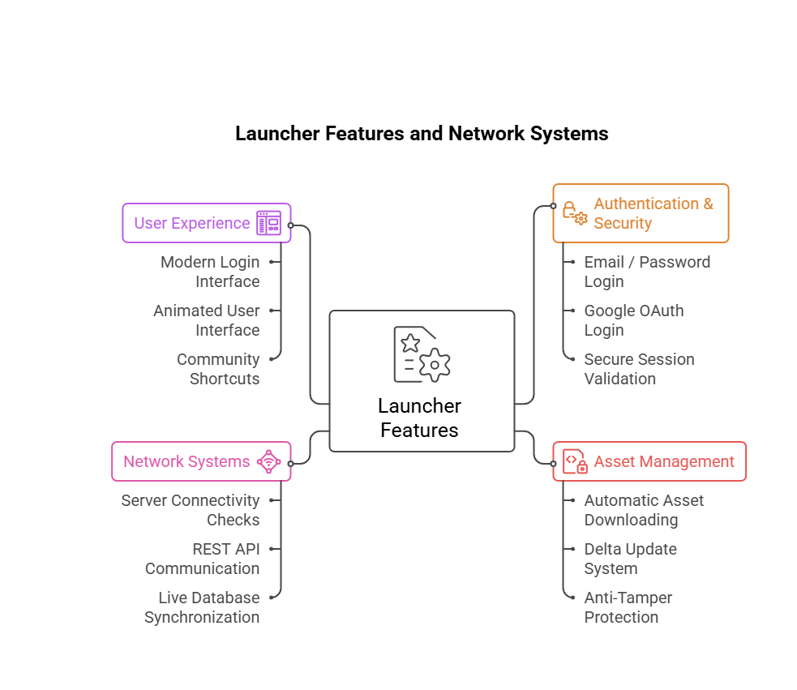

  

Grand RazX RP Online is a cross-platform CRMP multiplayer project built on GTA San Andreas, allowing Android and PC players to connect and play together on the same server.

The project has been developed independently for over a year and combines Android development, native C++ integration, multiplayer networking, authentication systems, database infrastructure, asset management, and custom launcher technology into a single ecosystem.

## ❀ Project Highlights
● Cross-Platform Gameplay (Android + PC)
● Custom Android Launcher

● Multiplayer Server Infrastructure

● Firebase Authentication System

● Google Sign-In Integration

● SQL Database Management

● Native C++ Modules via JNI

● Asset Streaming & Auto Updates

● Anti-Cheat File Verification

● Secure Login & Session Management

● Real-Time Server Status System

● Custom UI & Animations

● Player Account Management

● Roleplay Gameplay Systems

## 🛠️ Technology Stack

### 📱 Client & Launcher

### 🎮 Multiplayer Server

### ☁️ Backend & Infrastructure

### 🔧 Development Tools

## 🚀 Launcher Features & Network Systems

The Grand RazX RP Online Launcher serves as the central hub connecting players to the multiplayer ecosystem. It manages authentication, asset delivery, backend communication, and user experience through a unified and secure architecture.

  

---

### 🔐 Authentication & Security

A secure authentication framework designed to protect player accounts and maintain session integrity.

#### Features
- Email & Password Login
- Email & Password Registration
- Google OAuth Authentication
- Secure Session Validation
- User Profile Creation
- Protected Sign-Out System

#### Functionality
The authentication layer verifies user credentials, manages active sessions, secures account data, and provides multiple sign-in methods for a seamless and secure login experience.

---

### 📦 Asset Management

A complete asset delivery and deployment system responsible for maintaining game files and updates.

#### Features
- Automatic Asset Downloading
- Delta Update System
- File Integrity Verification
- Anti-Tamper Protection
- Game Directory Configuration
- Native Game Launch Execution

#### Functionality
This module automatically downloads required resources, validates file integrity, applies updates efficiently, and launches the game through a controlled deployment pipeline.

---

### 🌐 Network Systems

A dedicated communication layer connecting the launcher to backend services and multiplayer infrastructure.

#### Features
- Server Connectivity Checks
- REST API Communication
- Live Database Synchronization
- Real-Time Server Status Monitoring

#### Functionality
The networking system enables secure communication between the launcher, authentication services, databases, and multiplayer servers while providing real-time status information.

---

### 🎨 User Experience

A modern and responsive interface designed to provide a smooth onboarding and gameplay preparation experience.

#### Features
- Modern Login Interface
- Animated User Interface
- Dashboard & Profile System
- Community Shortcuts
- Support Center Integration
- Loading & Processing Screens

#### Functionality
The user experience layer focuses on accessibility, responsiveness, and usability, ensuring players can easily manage accounts, access community resources, and launch the game.

---

### ⚙️ System Architecture

The launcher is built around four interconnected core modules:

1. **Authentication & Security**
2. **Asset Management**
3. **Network Systems**
4. **User Experience**

Together, these modules provide secure account management, automated content delivery, real-time backend communication, and a modern cross-platform launcher experience for both Android and PC players.

> **Grand RazX RP Online** is developed independently and represents over a year of continuous development across Android, C++, multiplayer server systems, backend infrastructure, authentication services, and database technologies.
